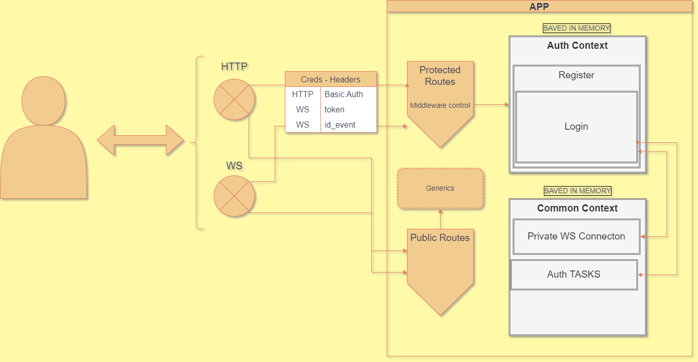

## INSTALACIÓN

> **Dos formas de instalar**
    
- Instalar en cada proyecto (api - cli) de forma individual: ``npm install`` dentro de cada carpeta

- Instalar de forma concurrente desde raiz del proyecto general: ``npm run dev:install`` 


> **Ejecutar**

- Abrir una terminal en cada proyecto (API - CLI) y ejecutar ``npm run start:local``
- De forma concurrente desde raiz del proyecto general: ``npm run dev``

> **A tener en cuenta**

- Si se ejecuta este último método al terminar los procesos en Poweshell de Windows se debería ejeuctar:
     ```netstat -ano | findstr :PORT``` 
      ``taskkill /PID 'PID' /F``

## CLIENT

- React - Redux
- Axios 

### BASE

- Puerto por defecto: 3000
- Login - Registro de nuevo usuario - Logout
- Crear - Editar - Eliminar - Obtener tareas (CRUD)
- Pages auth - auth/register - / - /tasks

## API

### Tecnología

- NodeJs
- Typescript
- Express
- Websocket

### Herramientas

- Postman
- Newman
- Eslint
- Prettier
- Git
- winston

### ¿Cómo funciona?

> **Descripción** (VER IMAGEN ANEXA AL FINAL DEL DOCUMENTO) 

- A traves del servicio podemos trabajar sobre un CRUD de tareas y autenticación básica.
- A través del mismo puerto conectamos tanto con servicios websocket como realizar peticiones http. **Websoket se implementa para definir alarmas de tareas, sin embargo esta esta incompleta**

    - Rutas protegiadas: 

        - HTTP: Procesos de login - registro de usuario - simular operaciones de TODO LISTS - logout.
        - WS: Incompleto.

- Para la demo se trabaja sin modelamiento y conexión con base de datos. Para suplantarlo se almacena la información directo en memoria. Para tal fin, se crean contextos globales al iniciar el servicio sobre las cuales se guarda informacion de conexión, registros de usuarios, autenticación (login), subscripciones a eventos y CRUD tareas.


    - CONTEXTO PRIVADO:  >> ANEXO 1.0

        - Para que pueda acceder a peticiones HTTP y conexión WS como usuario privado primero se debería registrar y luego realizar login. Al registrarse, la información es almacenada en el contexto de "rgister" en "auth context". 
        - Al realizar login, recibe un token que debe pasar por header en rutas protegidas(Basic auth) "Authorizarion: Bearer -token-" para http y "token: -token-" para ws. El login es registrado y almacenado en el contexto junto con la información otorgada. En el response se envía un token y un id_event, el cual debería ser utilizado en WS y pasarlo por header como id_event.
        - En este caso cuando el usuario se conecte a WS, esta es registrada y almacenada en el contexto de "private WS Connection" en "common context", utilizando el id_event como id único de conexión, a la vez que se otorga un id de conexión, de tal forma que, si el mismo usuario realiza una conexión paralela, cada una podrá almacenar procesos de suscripcion individuales identificadas por id de conexión y dentro del mismo registro de conexión a WS inicial por id_event. Si este es incorrecto, entonces la conexión no es factible.
        - Se puede simular el proceso de CRUD del TODO LIST guardando los mismos en memoria dentro del contexto.
        - El procesos de logout simplemente elimina la sesión del usuario, de forma que no se podrá volver a acceder sin antes hacer login. Se se da este último nuevamente, se comprueba que los registros se mantienen en memoria.
        
    - La información almacenada en memoria no tiene persistencia y se elimina cada vez que se reinicia el servicio.

> **Endpoints**

- /api/auth/register | POST
    - Verifica el contexto de registro
    - Verifica si el usuario existe en registro
    - Inserta Nuevo usuario
    - Encripta password
    - Devuelve error si el usuario ya existe o no se envian los datos requeridos
    - EJEMPLO REQUEST: POST
         
         
                ``curl --location 
                    'http://localhost:4000/api/auth/register' \
                    --header 'Content-Type: application/json' \
                    --data '{
                    "username": "test1",
                    "password": "test123*"
                    }'``

- /api/auth/signin | POST
    - Verifica si existe contexto de login
    - Verifica si el usuario existe dentro del contexto de registro
    - Verifica si el usuario ya se encuentra login
    - Crea contexto de login si no existe
    - Crea nueva sesion de usuario si no existe
    - Actualiza token de sesion si no existe
    - Crea token
    - EJEMPLO: POST
         
                ``curl --location 
                    'http://localhost:4000/api/auth/signin' \
                    --header 'Content-Type: application/json' \
                    --data '{
                    "username": "test1",
                    "password": "test123*"
                    }'``

- /api/auth/signout | GET
    - Previamente es testeado por el middleware de autenticacion
    - Requiere solo el envio de token basic auth
    - Verifica que exista contexto de login y que el usuario exista
    - Elimina sesion del contexto de login
    - EJEMPLO: GET

                ``curl --location 'http://localhost:4000/api/auth/signout' \
            --header 'Authorization: Bearer <token>'``


- /api/tasks | POST
    - Se agrega nueva tarea
    - EJEMPLO: POST

            ``curl --location 'http://localhost:4000/api/tasks' \
                --header 'Authorization: Bearer -token-' \
                --header 'Content-Type: application/json' \
                --data '{
                    "title": "Title 1",
                    "alarm": false,
                    "completed": false
                }'``

- /api/tasks | GET
    - Se obtiene el registro de todas las opearciones abiertas y cerradas del usuario.
    - EJEMPLO: GET

            ``curl --location 'http://localhost:4000/api/tasks' \
                --header 'Authorization: Bearer -token-'``


- /api/tasks/:taskid | PATCH
    - Se agrega nueva tarea
    - EJEMPLO: PATCH

            ``curl --location 'http://localhost:4000/api/tasks/:taskid' \
                --header 'Authorization: Bearer -token-' \
                --header 'Content-Type: application/json' \
                --data '{
                    "title": "Title 1",
                    "alarm": false,
                    "completed": false
                }'``

- /api/tasks/:taskid | DELETE
    - Se obtiene el registro de todas las opearciones abiertas y cerradas del usuario.
    - EJEMPLO: DELETE

            ``curl --location 'http://localhost:4000/api/tasks/:taskid' \
                --header 'Authorization: Bearer -token-'``

- /api/test_view | GET
    - Al inicializar la api se lleva a cabo un proceso de testing que puede ser observada en la consola del cliente, la cual tambien genera un reporte html, que puede accederse a traves de este endpoint desde el navegador.
    ``http://localhost:4000/api/test_view``


> **Conexión a WebSocket**

- /api/gateway                   

    - Conexión privada:

        - Pensada para recibir alertas de tareas - **Incompleta**
            
                    token: <token>
                    id_event: <id_event>
        

> **Otras características**

- El testing se realiza sobre HTTP utilizando Postman y newman sobre el código. En la carpeta src/test_newman se encuentran los json exportados de Postman y la configuración basica de newman.
- Cuando se inicia el servidor, se ejecuta automaticamente el test, generando un reporte por consola y html el cual puede ser verificado en 
``http://localhost:4000/api/test_view``
- Se utiliza como formateador de codigo y control eslintrc y prettier.
- Se generan logs de error e información con winston.
- Enviroments se setean en src/infraestructure/server/envs
- Luego de ejecutar el test se insertan las tareas provenientes de https://jsonplaceholder.typicode.com/todos al usuario agregado durante el test y que es utilizado como demo inicial en FE.

> **Instalación**
- Se debe tener NodeJs instalado.
- Si se requiere modificar enviroment:
    - src/infraestructure/server/envs/.env.local
- En consola y sobre la raíz del proyecto ejecutar:
    - Instalar:
        - ``npm install`` || ``npm install --force``
        - Recomendado pero no requerido: ``npm install -g newman``
        - Recomendado pero no requerido: ``npm install -g newman-reporter-html``
    - Ejecutar en local:
        -``npm run start:local``


> **Durante la iniciacón**

- Una vez inicializado se ejecuta automáticamente el test por newman y se genera el reporte html, el cual tambien es observado desde consola.

> **Consideraciones**

- Se puede importar los archicos .json de test_newman al postman donde se puede probar manualmente.

## Nota Final

- En lugar de utilizar testing uitario con Jest o Mocha - Chai, decidí implementar otras herramientas de testing y documentación que permiten controlar luego un proceso de CI/CD de forma automatica. 


## ANEXO

> **1.0**

